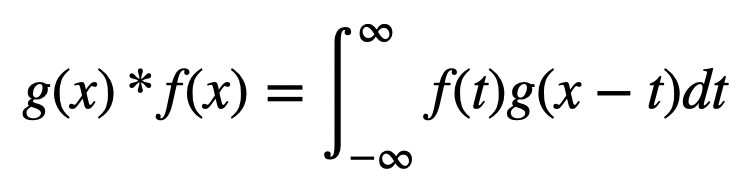

# Meeting 1 PS

## Introduction to Neural Networks
So, the 3B1B video describes the basics of neural networks taking an example of the handwritten digit detection system.
As for the basics of neural networks :
1. It would consist of neurons ( term named exactly same as in the real brain ), although a neuron is just something that contains a number between 0 and 1 and that represents the activation probability of that particular neuron. The magnitude of the number signifies the measure of the chances that the condition linked with the neuron is true.
2. Here, by the condition linked with the neuron, I mean the condition thinking which a particular neuron has been programmed, for eg in the digit recognition system. We can have a neuron that signifies the colour of a particular pixel in the image provided.
3. Neural networks consist of layers, the first layer being highly straight forward and as we oo deeper into the network, we find that neurons in deeper layers are activated on more specific conditions or cases.

For a much clearer explanation, lets take the case of that digit recognition system.
1. The first layer has exactly the same number of neurons as the number of pixels in the image, each pixel being matched to each neuron. To make things easier for the model and even for us, lets first convert the image into black and white so it would be much easier to assign the activations of the neurons in the first layer ( expect simple brightness or shades of grey ).
2. Now, lets go deeper to the second layer. We have now a distinct function for neuron that decides its activation on the basis of the first layer neurons. Lets now assume a perfectly trained model for better understanding. An already trained model ( considering ideal case ) would have perfectly adjusted weights. So, we can say that let say we want a particular part in the image to be white ( i.e. pen mark over there in the image ), we can take all the first layer neurons ( corresponding to all the pixels in the part we desire ) and assign them high value in weights and rest pixels to be zero. So, now we know that this neuron would be activated only when we would have a mark on the image at that particular spot.
3. Now, as we go deeper we can target bigger sections of image and that makes these neurons more specific since they get activated only when they find a similarity in a relatively larger-in-size pattern they are assigned.
4. So, when we reach the final layer, we can expect neurons specific to patterns covering whole digits and that gives us the result. As for this example, we would have 10 neurons in the final layer because 0-9 digits.

Now lets think about what would actually happen since we cannot assign all the weights by ourselves. But what we now is the general form of the equation which we can program easily. We used random number generation for the weights. So, in the start the model gives trash responses. To tackle this, we must need to adjust the weights. For that we find the error between what the model responded and the actual expected response or correct answer. To minimize this error, we use a mathematical concept namely, Gradient Descend that says " The gradient of a multivariable function gives the line of maximum slope or increasing change ". To implement in real life,in short, we find the effect of change of the every weight in the function that defines the neuron. And we tend to go against the direction that Gradient Descend gives us, because we can expect a maximum decrease in the error in the direction. The magnitude of change in weights ideally would depend on the how big the error is because with that we can expect reduce in overshooting of the parameters. With every training record, the model would update its weights. And what we finally get is a fully trained model.
We can test it on the basis of a testing set.
And yes, for the mathematics amd implementation part, we do represent all the weights in form of matrices because that makes finding the next layers activation probabilities fairly easy as we are just left out with a matrix multiplication for which we have libraries. Also, we might choose to put a benchmark on activation of neurons. By benchmark here, I mean to say that some value of activation below which the neuron is considered to be inactive even though it has a small activation but since the value is smaller than the benchmark.Ohh! I remember the word now, "Threshold". This threshold can also be implemented in various ways i.e. just different mathematical functions like maybe step function, or sigmoid etc. As described in the video, we have Lisha Li explaining that ReLU ( Rectified Linear Unit ) learns faster than sigmoids.

Sorry, that's way longer than 300 words 😅 but that's how I could convey it completely.

## Convolution

The video, in short, discusses various ways to visualize convolution.
Mathematically convolution is :

But here, we visualize it like:
1. Linear List Convolution:
    If we want to let say convolute two list together, what we can do is to reverse a list, place it below the other and keep shift it by one place and multiplying the aligned values and calculating the sum and then forming a list out of all those sums that we have found out.
2. To extend the same point, we can very similarly explain convolution of functions like if we have discretized values at certain intervals. That reduces to an array.
3. Image Processing: We know, that every image is nothing but a 2-dimensional array of multiple channels. Basically, a two-dimensional array of pixels where each pixel is described by its several channels like BGR or HSV. It might also be black and white and that would require only 1 channel like 0-255 BW. So, here to understand convolution we must have another array of same kind or channels I mean to say. So, just as in the list we reversed it, here we can think of it as rotating it by 180 degrees. In this case, we call this matrix ( not the image, the other one ), a kernel. This kernel moves throughout the image and calculates the sums for the pixels and these pixels can now be arranged just like the original one to form another image and done, we got the processed image. This can be used to process the image to get different results like edge detection, blurring the image ( best : Gaussian blur ), etc.

As a part of maths, we can think of it as multiplying two linear polynomials.
To make things quicker to process, we have Fourier Transforms and its implementation fft, dft that are already available to make things easier. 
As a part of probability distributions, convolution of 2 probability distributions would give us the addition of both of them which would help use understand the probability of events occurring together.